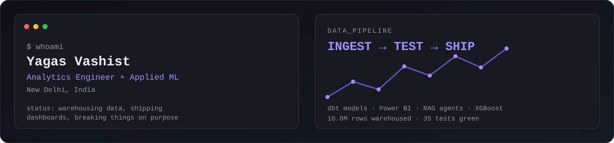
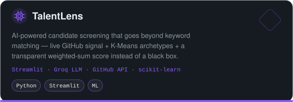
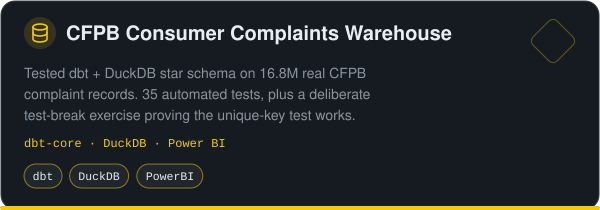
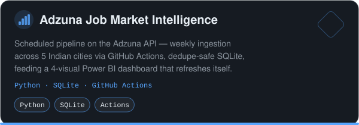
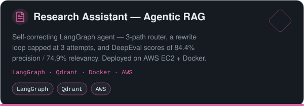
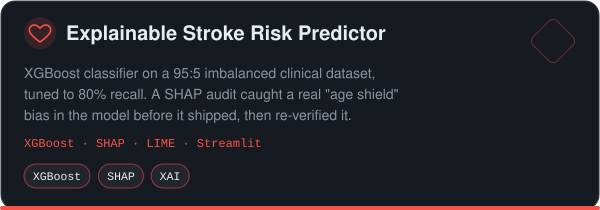
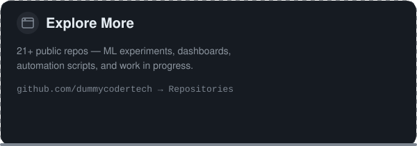

<div align="center">



<br />

<a href="https://github.com/dummycodertech">
  
</a>

<p>
  <strong>Data Analyst & Analytics Engineer (B.Tech IT '27) at BPIT, GGSIPU.</strong>
  <br />
  I turn raw, high-volume data into tested warehouses and stakeholder-ready dashboards — with hands-on work in agentic RAG and explainable ML.
</p>

<p>
  <a href="mailto:yagasvashist@gmail.com" target="_blank" rel="noreferrer"></a>
  <a href="https://linkedin.com/in/yagas-v-a4ba3435b" target="_blank" rel="noreferrer"></a>
  <a href="https://github.com/dummycodertech" target="_blank" rel="noreferrer"></a>
</p>

</div>

---

```ts
const yagas = {
  basedIn: "New Delhi, India",
  degree: "B.Tech IT, BPIT (GGSIPU) · Aug 2023 – May 2027 · CGPA 9.12/10",
  focus: ["analytics engineering", "data warehousing", "applied ML/GenAI"],
  building: ["dbt + DuckDB pipelines", "Power BI dashboards", "agentic RAG systems"],
  learning: ["MLOps", "advanced RAG patterns", "actuarial science (IAI, ACET-cleared)"],
  openTo: ["Data Analyst / Analytics Engineer roles", "internships", "collabs"],
};
```

### Currently in the Lab

- Building dimensional warehouses (dbt + DuckDB) with automated schema testing instead of trusting raw CSVs.
- Shipping agentic RAG systems — self-correcting retrieval loops, multi-tenant vector stores, LangGraph routing.
- Turning messy operational data into Power BI dashboards that non-technical stakeholders actually use.
- Practicing explainable ML — SHAP/LIME audits to catch bias before it ships, not after.
- Cleared the Actuarial Common Entrance Test (ACET) — Student Member, Institute of Actuaries of India.

### Featured Builds

<div align="center">

<p>
<a href="https://github.com/dummycodertech/TalentLens" target="_blank" rel="noreferrer"></a><a href="https://github.com/dummycodertech/cfpb-powerbi" target="_blank" rel="noreferrer"></a>
</p>

<p>
<a href="https://github.com/dummycodertech/adzuna-job-intelligence" target="_blank" rel="noreferrer"></a><a href="https://github.com/dummycodertech/research-assistant-agentic-rag" target="_blank" rel="noreferrer"></a>
</p>

<p>
<a href="https://github.com/dummycodertech/xai-xgboost-heart_Stroke" target="_blank" rel="noreferrer"></a><a href="https://github.com/dummycodertech?tab=repositories" target="_blank" rel="noreferrer"></a>
</p>

</div>

### Experience

**Digitization & Analytics Intern** — Dalmia Bharat Foundation · Jul 2026 – Aug 2026
Built a 33-pivot-table, 9-slicer Excel dashboard (16 dynamic graphs, 4 KPI cards) covering CSR department headcount, role, CTC, and location data, used by HR to track onboarding — plus standalone onroll/offroll compliance trackers adopted across CSR units.

**ML Intern** — Solid State Physics Laboratory, DRDO · May 2025 – Jul 2025
Built a traffic-flow regression model on 48,120 hourly records from 4 urban junctions; benchmarked 8 algorithms and deployed Random Forest at **0.91 R²** to a live Smart Traffic Control dashboard, with temporal feature engineering lifting R² by 28% over baseline.

### Tech Stack & Tools

<div align="center">

**Languages**
<br />


**Analytics Engineering & BI**
<br />


**ML & Applied GenAI**
<br />


**Tools & Automation**
<br />


</div>

### GitHub Activity

<div align="center">


<br />


<br />


<br />


</div>

### 3D Contribution City

<div align="center">

<a href="https://gitcity.natrajx.in/dummycodertech" target="_blank" rel="noreferrer">
  
</a>

<sub>Profile views: </sub>

</div>

### Certifications & Achievements

- **Actuarial Common Entrance Test (ACET)** — Cleared, Jun 2026 · Student Member, Institute of Actuaries of India (IAI)
- **AI Agent Architect** — CSRBOX in collaboration with IBM SkillBuild, Aug 2025
- **Advanced RAG** — CampusX, Jul 2026
- **Complete Data Science Bootcamp** — Udemy, Dec 2025
- **Rotaract Club of BPIT-Drishti** — Volunteer, 100+ hrs in community education, Aug 2025–Present

---

<div align="center">
  <strong>pipelines that don't lie to you · dashboards people actually open</strong>
</div>
